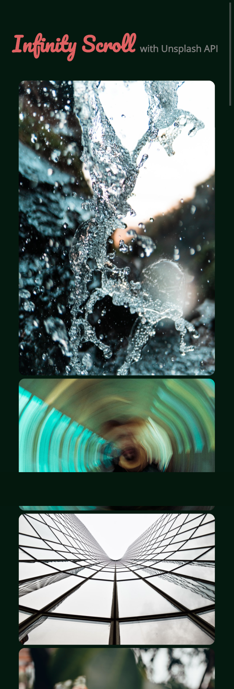

# infinity scroll 

- Built with HTML, CSS and Javascript.
- fetch more photos when reach to the bottom using unsplash api

- second challenge of 20JScourse. referenced project idea and codes.

course-reference
https://academy.zerotomastery.io/p/javascript-projects

---

[-> go to live server](https://ehdgodgka.github.io/js20-infinity-scroll/)
